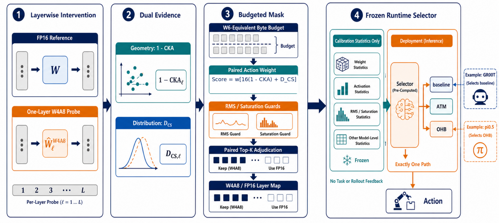

# GDSQ-VLA

### Geometry- and Distribution-Sensitive Layer Selection for Post-Training Quantization of Vision-Language-Action Models

[Under review — CVPR 2026 anonymous submission] · [Apache-2.0](LICENSE)

**GDSQ-VLA** is a training-free, mixed-precision post-training quantization (PTQ) framework for
vision-language-action (VLA) policies. It decides *where* to quantize (which Linear layers become
W4A8 and which stay FP16) and *whether* a runtime correction is warranted — without retraining,
without task identity, and without rollout feedback. The pipeline is evaluated on **GR00T N1.5**
and **π0.5** over the RoboCasa365 benchmark.



## Abstract

Post-training quantization can reduce the static storage of vision-language-action (VLA) policies,
but uniform precision overlooks the different numerical sensitivity of language reasoning and
iterative action generation. We present **GDSQ-VLA**, a training-free mixed-precision framework
that combines geometry and distribution preservation, paired action sensitivity, stability guards,
and complete-configuration adjudication to allocate W4/FP16 layers under a frozen byte budget. The
final method additionally uses a calibration-gated runtime correction selector: from model-level
calibration statistics alone, it chooses the uncorrected policy, attention-temperature modulation
(ATM), or output-head balancing (OHB), never their uncalibrated combination. The selector does not
use task identity, rollout outcomes, or runtime success feedback. On RoboCasa365, 256-observation
equivalence tests are bitwise exact for both evaluated policy families, allowing the GR00T
selector's baseline decision to reuse its frozen 50-task evaluation. This final GR00T configuration
obtains **50.8% task-macro success at a theoretical 1.99× candidate-component compression**,
compared with 55.1% for FP16.

## Method Overview

The allocation pipeline has four stages, followed by a correction-decision stage:

1. **Isolated quantization interventions.** Each candidate Linear layer is quantized to W4A8
   (DuQuant-style grouped weights, group size 64) while every other layer follows a full-precision
   attribution reference path, so W4 damage is attributed to a single layer.
2. **Dual similarity, action weighting, and guards.** Centered kernel alignment (CKA) measures
   preservation of inter-sample geometry; an empirical Cauchy–Schwarz (CS) divergence covers the
   scale-blind spot; paired action-trajectory sensitivity weights `w_i` rank layers by their effect
   on control; RMS-drift and saturation guards force FP16 for infeasible layers.
3. **Byte-constrained mask search.** A 0-1 knapsack under a frozen weight-storage byte budget
   generates diverse W4/FP16 masks (greedy allocation + local bit flips). Budgets: GR00T
   862,912,512 B; π0.5 2,042,542,080 B (uniform-W6 candidate scope).
4. **Functional adjudication.** Top-K complete masks are calibrated and compared as whole policies
   under paired observations and noise, with `D_func = D_final + D_kin + D_grip + 2·CVaR₀.₉(D_solver)`
   guarding against severe denoising failures. The frozen ratio selects CKA:CS = 16:1. Final masks:
   **100/116** W4 layers for GR00T, **80/180** for π0.5 (protected attention projections stay FP16).
5. **Calibration-gated runtime correction selector.** From model-level calibration geometry and
   three preregistered thresholds, the selector admits at most one of {baseline, ATM, OHB} —
   never ATM+OHB. The frozen v8 rule selects **baseline** for GR00T and **OHB** for π0.5; both
   decisions are bitwise identical to their static paths on 256 frozen observations per model.

## Key Results — RoboCasa365 (50 paired seeds per task)

| Configuration | Low-bit | Atomic SR↑ | C-Seen SR↑ | C-Unseen SR↑ | All SR↑ | Size (GiB)↓ | Comp.↑ |
|---|---:|---:|---:|---:|---:|---:|---:|
| **GR00T N1.5** | | | | | | | |
| FP16 | — | 75.6 | 41.9 | 45.3 | 55.1 | 1.993 | 1.00× |
| QuantVLA W4A8 | 116 W4 | 49.6 | 19.6 | 19.8 | 30.4 | 0.898 | 2.22× |
| Uniform W6 | 116 W6 | 68.4 | 42.9 | 41.8 | 51.7 | 1.109 | 1.80× |
| Ω-QVLA W4A4‡ | 180 W4 | 60.1 | pending | pending | pending | 0.599 | 3.33× |
| **GDSQ-VLA (ours)** | 100 W4 | **69.0** | **40.6** | **40.4** | **50.8** | **1.001** | **1.99×** |
| **π0.5** | | | | | | | |
| FP16 | — | 58.3 | 14.0 | 2.1 | 26.2 | 4.113 | 1.00× |
| QuantVLA W4A8 | 180 W4 | 56.1 | 12.8 | 1.8 | 24.8 | 1.388 | 2.96× |
| Uniform W6 | 180 W6 | 56.6 | 10.9 | 2.1 | 24.5 | 1.902 | 2.16× |
| Ω-QVLA W4A4‡ | W4A4 | pending | pending | pending | pending | pending | pending |
| **GDSQ-VLA (ours)** | 80 W4 | **57.8** | **17.0** | **3.9** | **27.5** | **1.868** | **2.20×** |

Size is theoretical tightly packed candidate-Linear storage (excluding activations, CUDA
workspaces, simulator state, and fake-quant caches). ‡Ω-QVLA uses RoboCasa365-specific calibration;
its GR00T Atomic cell is complete (900 episodes), remaining cells await exact coverage.

**How to read these numbers (matching the paper's claims):**

- **GR00T**: 50.8% all-task at 1.99× compression vs 55.1% FP16. Against the same-byte-ceiling
  Uniform W6 control (51.7% at 1.80×) the gap is −1.0 pt with 95% CI [−3.1, 1.2]: we report
  *competitive storage–accuracy*, not superiority. QuantVLA W4A8 (30.4%) compresses at a
  different rate (2.22×) and is a descriptive secondary comparison (+20.3 pt, CI [16.9, 24.0]).
- **π0.5**: 27.5% at 2.20×. The OHB selector exceeds QuantVLA W4A8 by +2.6 pt (CI [0.9, 4.5],
  Holm-adjusted p = 0.023), but the FP16 difference (−1.3 pt) crosses zero and same-budget
  superiority remains unproven: π0.5 is reported as an *architecture boundary*.
- **No latency or live-memory claim**: the current path is eager fake quantization (FP storage,
  FP GEMMs); packed-checkpoint size and isolated server latency are reported separately, and
  deployment gains require fused INT4/INT8 kernels.

## Repository Layout

```
code/gr00t/              # GR00T N1.5 stack: model, DuQuant W4A8 layers, CKA/CS score bank,
                         #   ATM/OHB, calibration-gated runtime selector, experiment infra
code/pi05/               # π0.5 (openpi) stack: serve/eval scripts, quantization entrypoints
code/pi05/openpi/        # vendored openpi source (local PATCHES marked in-tree)
scripts/                 # launch/eval/ops scripts (servers, LIBERO/RoboCasa clients, plan tools)
scripts/tools/           # sensitivity probe, W4/FP16 plan selector, ATM/OHB calibration,
                         #   Top-K D_solver adjudicator, metric audit, baselines
docs/gdsq_vla_cvpr2026/  # paper source (LaTeX), figures, tables, experiment_registry.json,
                         #   claim--evidence audit (§: claim gate), reference_audit.md
docs/paper/              # referenced papers
docs/getting_started/    # setup notebooks and walkthroughs
environments/            # conda env definitions
deployment_scripts/      # TensorRT export/inference experiments
tests/                   # unit tests + gating entrypoints
```

Model checkpoints, calibration packs, datasets, rollout outputs and the vendored simulators are
**not** committed (see `docs/gdsq_vla_cvpr2026/` and the notes below).

## Quick Start

### GR00T N1.5 (terminal 1: server, terminal 2: evaluation)

```bash
# terminal 1 — inference server (default libero_10)
./scripts/run_inference_server.sh libero_10

# terminal 2 — evaluation
./scripts/run_libero_eval.sh libero_10 --headless

# quantized server (DuQuant W4A8 + plan-driven mixed precision)
./scripts/run_quantvla.sh libero_10
```

Task suites: `libero_spatial | libero_goal | libero_object | libero_90 | libero_10`.
Checkpoints are read from `checkpoints/gr00t/libero-*` (local HF-style layout); quantization
caches map to `checkpoints/packs/gr00t/duquant_packed_libero_${suite}_w4a8_b64c32ls015`.

### π0.5 (openpi)

```bash
cd code/pi05/openpi && conda activate openpi

# terminal 1 — policy server (JAX bf16)
CUDA_VISIBLE_DEVICES=5 python scripts/serve_policy.py --env LIBERO --port 8001 \
  policy:checkpoint --policy.config pi05_libero \
  --policy.dir /path/to/pi05_libero_pytorch

# terminal 2 — LIBERO evaluation
export PYTHONPATH=$PWD/third_party/libero:$PYTHONPATH
CUDA_VISIBLE_DEVICES=5 python examples/libero/main.py \
  --args.host 127.0.0.1 --args.port 8001 \
  --args.task_suite_name libero_spatial --args.num_trials_per_task 50

# quantized server (DuQuant W4A8 packs + ATM/OHB; see code/pi05/run_libero_serve_quant.sh)
OPENPI_DUQUANT_WBITS_DEFAULT=4 OPENPI_DUQUANT_ABITS=8 OPENPI_DUQUANT_BLOCK=64 \
OPENPI_DUQUANT_LS=0.15 OPENPI_DUQUANT_PERMUTE=0 OPENPI_DUQUANT_ROW_ROT=restore \
OPENPI_DUQUANT_ACT_PCT=99.9 OPENPI_DUQUANT_CALIB_STEPS=160 \
OPENPI_DUQUANT_PACKDIR=/path/to/pi05_w4a8_b64c160ls015 \
OPENPI_ATM_ENABLE=1 OPENPI_ATM_ALPHA_PATH=/path/to/atm_alpha_beta_pi05.json \
OPENPI_ATM_SCOPE=expert OPENPI_OHB_ENABLE=1 OPENPI_OHB_SCOPE=expert \
CUDA_VISIBLE_DEVICES=5 python scripts/serve_pi05_quant_policy.py --env LIBERO --port 8002 \
  --policy.config pi05_libero --policy.dir /path/to/pi05_libero_pytorch
```

## Reproducibility & Claim–Evidence Gate

Formal numbers come from `docs/gdsq_vla_cvpr2026/experiment_registry.json` and the frozen summary
artifacts; do not hand-edit `docs/gdsq_vla_cvpr2026/tables/main_results.tex` (it is
auto-generated). Every result row binds checkpoint, plan, calibration, selector, launcher,
evaluator, environment, task list, and seed coverage by SHA-256.

```bash
make test-robocasa   # RoboCasa gating tests
make test-gr00t      # GR00T gating tests
make test-openpi     # openpi/π0.5 gating tests
make test-paper      # regenerate PDF + claim--evidence hash, main-table source, reference,
                     #   overfull-box, and 8-page-limit audits
make test-gdsq       # full GDSQ gate
```

`make test-paper` regenerates the PDF and verifies that only fully covered, manifest- and
hash-audited experiments can enable paper claims.

## Paper

- Paper source (LaTeX, figures, tables, audit registry): [`docs/gdsq_vla_cvpr2026/`](docs/gdsq_vla_cvpr2026/)
- Status: **anonymous submission under review (CVPR 2026)**. Citation will be added upon acceptance.

## Notes

- **Not included in git** (regenerate or fetch locally): model checkpoints
  (`checkpoints/`, `code/pi05/checkpoints/`), quantized packs (`code/pi05/packs/`), datasets
  (`data/`), rollout outputs (`runs/`, `code/pi05/rollouts/`), and the vendored simulators /
  third-party stacks (`code/robocasa/`, `code/LIBERO/`, `code/third_party/`,
  `code/pi05/openpi/third_party/`, `.venv`s). Pin the public upstream releases referenced in
  `docs/gdsq_vla_cvpr2026/` and apply the PATCHED markers in-tree.
- The method is data-free: all calibration uses synthetic observations and paired noise.
- Runtime limitation: the current execution path is eager fake quantization; no latency or
  live-memory compression claim is made (see the paper's efficiency section).

## License

Apache License 2.0 — see [LICENSE](LICENSE).