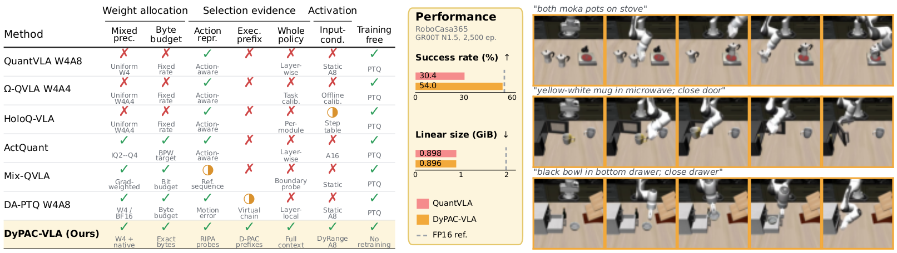
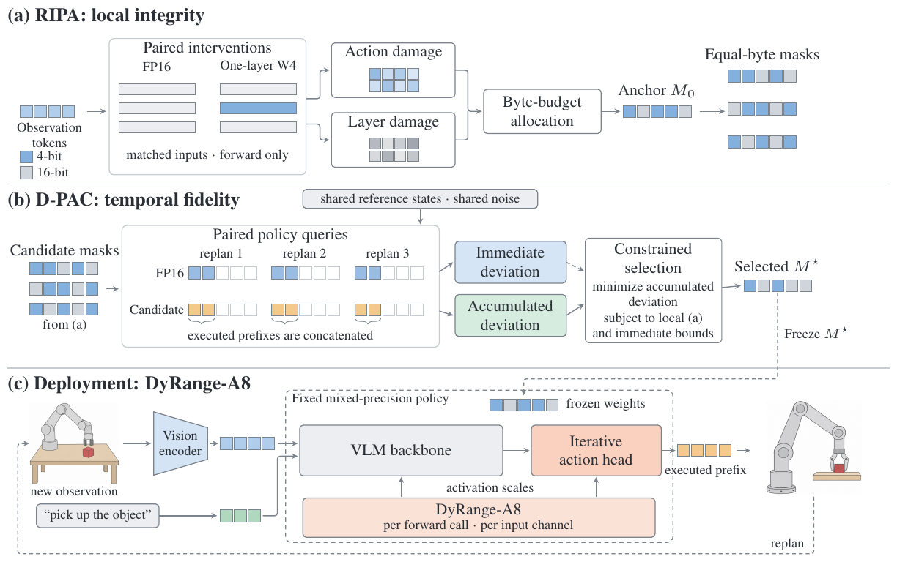
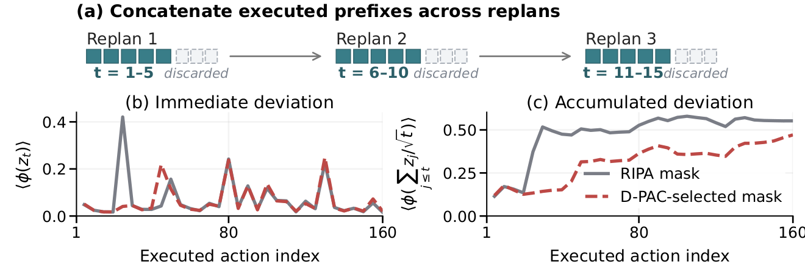
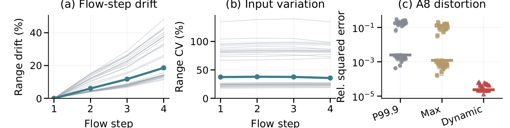

# DyPAC-VLA: Representation-to-Action Fidelity for Low-Bit Vision-Language-Action Models

Anonymous artifact for the ICLR 2027 submission. Licensed under [Apache-2.0](LICENSE).

**DyPAC-VLA** is a training-free post-training quantization pipeline for vision-language-action
(VLA) policies. It selects one mixed W4/native-16-bit weight mask offline and keeps that mask fixed
at deployment. The three method components are:

- **RIPA**, which probes local layer damage and downstream action-representation damage together;
- **D-PAC**, which scores complete policies by the action prefixes actually executed before
  replanning; and
- **DyRange-A8**, which recomputes input-channel activation ranges from every current forward input.



*Paper overview. DyPAC-VLA combines exact-byte mixed-precision allocation, complete-policy temporal
evidence, and input-conditioned activation ranges. The middle panel shows the matched GR00T N1.5
RoboCasa365 operating point; rollout success is evaluation-only and never selects a mask.*

## Method



*Method pipeline. RIPA constructs an exact-byte anchor and equal-byte candidates. D-PAC minimizes
accumulated executed-prefix deviation under local and immediate-action bounds. DyRange-A8 adapts
activation scales while the selected weight mask remains frozen.*

### 1. RIPA: offline representation-impact probing

RIPA quantizes one target layer in an otherwise native-16-bit policy and reads two paired signals on
matched inputs:

1. **Relational damage** at the final continuous-action representation, measuring distortion of
   centered sample-relation geometry.
2. **Distributional damage** at the intervened layer output, using a Gaussian kernel whose bandwidth
   is fixed from the reference representation.

Each signal is min-max normalized over the candidate-layer bank. Public helpers sample four fixed,
evenly spaced token rows per hook call and cap the concatenated bank at 256 rows, matching the paper
protocol. The combined layer importance is

```text
I_i = alpha * normalized_relational_i + (1 - alpha) * normalized_distributional_i
alpha = 16 / 17
```

RMS log-ratio and reference-tail checks form the protected layer set. The initial mask minimizes the
summed importance of W4 layers subject to the **actual packed-byte budget** and protected-layer
constraints. The implementation uses integer byte costs for packed W4 codes, FP32 group scales,
native weights, biases, fixed component bytes, and explicit metadata. It does not replace the budget
with a layer count or an approximate compression ratio.

### 2. D-PAC: accumulated deviation across executed prefixes

At every replan, the reference and candidate policies receive the same reference state and generative
noise. If the controller executes the first `K` actions of each predicted chunk, D-PAC concatenates
only those executed prefixes. For action coordinate `c` and environment-action position `t`,

```text
z[u,t,c] = (candidate_action[u,t,c] - reference_action[u,t,c]) / reference_scale[c]
phi(x) = 2 * (sqrt(1 + x^2) - 1)
L_step = mean phi(z[u,t,c])
L_acc  = mean phi(sum_{j=1..t} z[u,j,c] / sqrt(t))
```

The coordinate scale is computed once from reference selection actions and shared by all candidates
and noise streams. The selector minimizes `L_acc` among equal-byte masks that satisfy the RIPA local
bound, the immediate-action bound, and all protected-layer constraints. The local anchor is always a
feasible fallback. Held-out success is excluded from selection.

D-PAC is a common-state action-deviation criterion. It does not claim to predict success or measure
closed-loop physical displacement.



*D-PAC concatenates executed prefixes and retains persistent earlier deviations in the cumulative
target. The unexecuted suffix of each predicted chunk is excluded.*

### 3. DyRange-A8: current-input activation adaptation

For each quantized linear layer and each forward call, DyRange-A8 reduces over every current input
axis except the final input-channel axis:

```text
scale[c] = max(max_abs(current_input[..., c]) / 127, 1e-6)
quantized[..., c] = scale[c] * clip(round(current_input[..., c] / scale[c]), -128, 127)
```

Maxima are computed in FP32, and scales are cast to the input dtype. The range is recomputed for every
forward call. There is no calibration table, historical state, exponential moving average, flow-step
lookup, task selector, or runtime precision selector.



*Per-forward activation-range evidence from the paper. The fixed-mask comparison separates the A8
range rule from weight-mask selection.*

### 4. Weight quantization

Layers assigned W4 use reference-input second-order statistics, sequential Hessian-aware error
feedback, and input-channel groups of 64. Two signed four-bit codes are packed per byte and FP32 group
scales are retained. Layers assigned native precision remain native 16-bit. A16 evaluations disable
activation quantization; A8 evaluations apply DyRange-A8 with the same frozen weight mask.

## Main results: RoboCasa365

The representative configurations below are each evaluated on 50 tasks and 2,500 episodes. **Linear size** and
**compression** cover the same audited Linear-component inventory as the corresponding FP16 row;
other checkpoint tensors are outside these ratios.

| Backbone | Configuration | Allocation | Overall success | Linear bytes | Linear size | Compression |
|---|---|---|---:|---:|---:|---:|
| pi0.5 | FP16 | native | 26.2% | 4,416,602,112 | 4.113 GiB | 1.00x |
| pi0.5 | **DyPAC-VLA** | 121 W4 / 59 native | **27.7%** | 1,634,828,288 | 1.523 GiB | 2.70x |
| pi0.5 | DyPAC-VLA, all candidate layers W4 | 180 W4 / 0 native | 26.8% | 1,242,169,344 | 1.157 GiB | 3.56x |
| GR00T N1.5 | FP16 | native | 55.1% | 2,139,537,408 | 1.993 GiB | 1.00x |
| GR00T N1.5 | **DyPAC-VLA** | 100 W4 / 80 native | **54.0%** | 962,314,240 | 0.896 GiB | 2.22x |
| GR00T N1.5 | DyPAC-VLA, all candidate layers W4 | 116 W4 / 64 native | 52.8% | 837,206,016 | 0.780 GiB | 2.56x |

The pi0.5 selected plan reaches 27.7% success at 2.70x Linear-component compression, compared with
26.2% for FP16. GR00T N1.5 reaches 54.0% at 2.22x, compared with 55.1% for FP16. These are measured
operating points, not guarantees for other hardware, models, or tasks.

### Deployment evidence

On an idle NVIDIA A40 at batch size one, the evaluated masks reduce peak CUDA allocation from
5.386 GiB to 4.165--4.319 GiB, a measured 19.8--22.7% reduction. A separate paired integer-backend
comparison at one fixed mask reports a p50 latency ratio of 0.816 at identical peak allocation.
Kernel-level latency depends on integer backend support and is not a mask-level speed guarantee.

## Supporting evidence: LIBERO

The controlled LIBERO-Long selector study uses pi0.5, A16, and exactly **1,472,036,864 audited
weight-component bytes** for every selector row, corresponding to 3.00x component compression. Each
cell contains 400 held-out episodes.

Reference policies:

| Configuration | Successes / 400 | Mean success |
|---|---:|---:|
| FP16 reference | 372 / 400 | 93.00% |
| Uniform W6 | 369 / 400 | 92.25% |

Selector ablation:

| Configuration | Seed 1 | Seed 2 | Seed 3 | Mean success |
|---|---:|---:|---:|---:|
| RIPA only | 373 | 373 | 373 | 93.25% |
| D-PAC only | 372 | 371 | 371 | 92.83% |
| **RIPA + D-PAC** | 374 | 376 | 370 | **93.33%** |

The complete selector retains FP16-level success to within 0.33 percentage points at this budget. A
400-episode estimate near 93% has an approximately 1.3-point standard error, so this result should be
read as retention rather than improvement over FP16.

RIPA signal ablation at the same byte budget:

| RIPA signal | alpha | Successes / 400 | Success |
|---|---:|---:|---:|
| Relational site only | 1 | 372 / 400 | 93.00% |
| Distributional site only | 0 | 367 / 400 | 91.75% |
| **Both sites** | **16/17** | **373 / 400** | **93.25%** |

At a fixed GR00T mask and A8 precision on RoboCasa365, DyRange-A8 records 269/500 successes (53.8%)
versus 216/500 (43.2%) for dense static calibration, a measured 10.6-point difference. In a separate
same-mask LIBERO-Long comparison, moving from A16 to DyRange-A8 changes success from 371/400 (92.75%)
to 365/400 (91.25%); activation quantization therefore still has a measurable cost relative to A16.

## Repository layout

```text
scripts/dypac_vla_protocol.json                 public Method contract
scripts/tools/dypac_vla_protocol.py             protocol loader and validation
scripts/tools/quantvla_ripa.py                  dual-site RIPA probes and aggregation
scripts/tools/quantvla_selector.py              exact-byte allocation and constrained selection
scripts/tools/quantvla_metric_protocol.py       executed-prefix D-PAC metric
scripts/tools/quantvla_dynamic_a8_protocol.py   per-forward input-channel DyRange-A8
scripts/tools/quantvla_hessian_w4.py             Hessian-aware group-64 W4 and packing
scripts/tools/quantvla_table1_bytes.py           matched Linear-component accounting
examples/run_selftests.py                        six CPU self-tests
examples/demo_w4a8.py                            self-contained CPU Method demonstration
figures/                                         current paper figures exported for the README
```

## Quick start

```bash
pip install -r requirements.txt
make selftest
make demo
```

Both commands run on CPU and require no checkpoint, dataset, simulator, or model-family integration.
The self-tests directly cover RIPA's two-site aggregation and `alpha = 16/17`, exact packed-byte
allocation, cumulative D-PAC targets over executed prefixes, fresh per-forward input-channel
DyRange-A8 scales, signed group-64 W4 packing, and protocol invariants.

## Scope and omissions

This repository contains the public, model-agnostic Method core, protocol, synthetic demonstration,
tests, and web-viewable paper figures. It omits model checkpoints, datasets, calibration and
reference-state buffers, simulator harnesses, model-family adapters, rollout outputs, and the full
paper source. Those omissions keep the anonymous artifact small and avoid redistributing third-party
models or benchmark data.

## License

Apache-2.0; see [LICENSE](LICENSE).