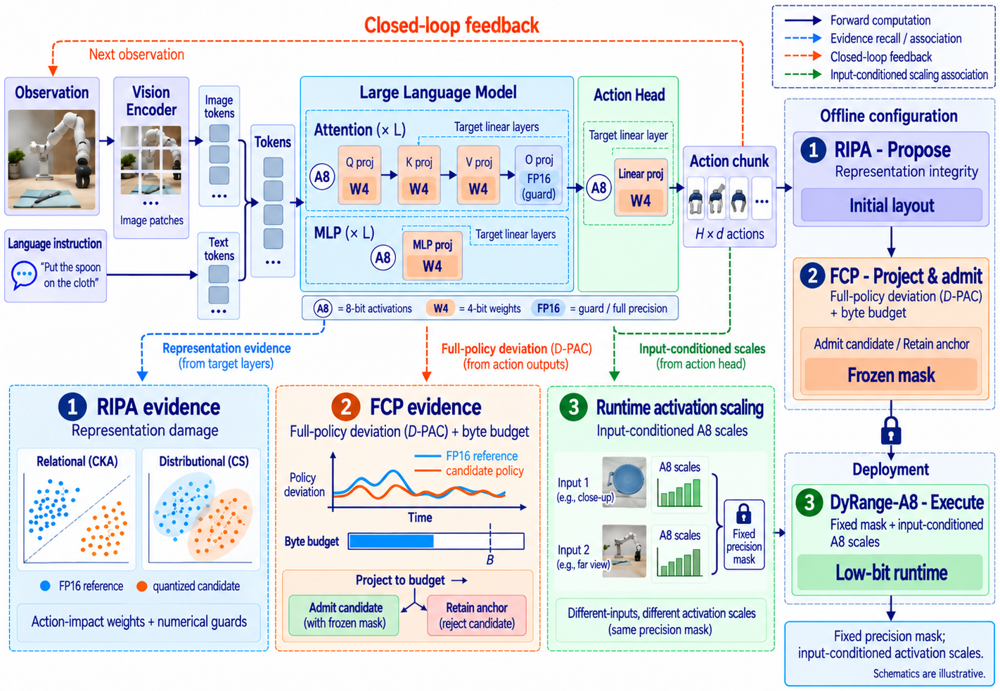
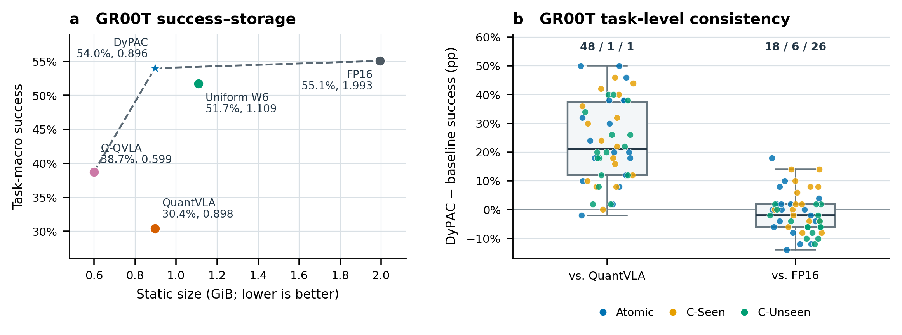
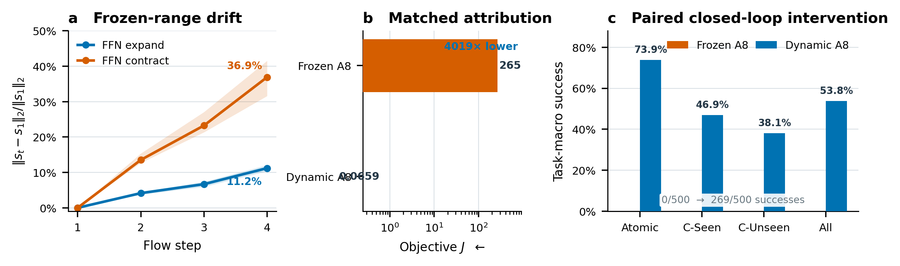
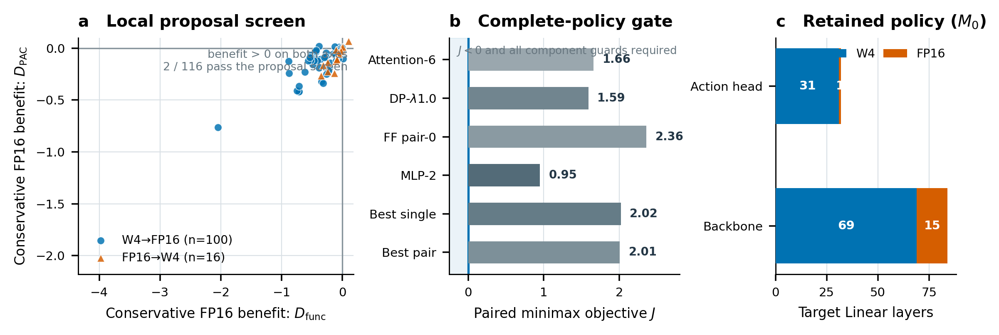

# DyPAC-VLA

### Full-Context Mixed-Precision Quantization for Vision-Language-Action Models

Anonymous artifact for the ICLR 2027 submission. [Apache-2.0](LICENSE).

**DyPAC-VLA** (*Dynamic-Range and Prefix-Accumulated Control-aware Quantization*) is a training-free
mixed-precision post-training quantization framework for vision-language-action (VLA) policies. It
evaluates precision decisions in the complete policy, freezes one global W4/FP16 mask under an exact
byte budget, and deploys that mask with Hessian-aware group-64 W4 weights and dynamic per-forward A8
ranges. It uses no task routing, success-label feedback, retraining, runtime selector, or action
correction.



*Figure 1. Three-stage representation-to-action quantization. RIPA compares relational and
distributional damage and produces a guarded layout. FCP evaluates paired action sequences with
D-PAC and component conditions, projects to the budget, and accepts an eligible candidate or retains
the anchor. DyRange-A8 keeps the deployment mask fixed while adapting activation scales to each
input. The diagram is schematic rather than a measured result.*

## Results

RoboCasa365, complete 50-task target split, 2,500 episodes per headline configuration. Success rates
are percentages; *Linear size* is audited Linear-component storage; *Comp.* is compression against
the FP16 row.

### GR00T N1.5 (high-success control)

| Configuration | Allocation | Atomic | Comp.-Seen | Comp.-Unseen | All | Linear size (GiB) | Comp. |
|---|---|---:|---:|---:|---:|---:|---:|
| FP16 | -- | 75.6 | 41.9 | 45.3 | 55.1 | 1.993 | 1.00x |
| QuantVLA W4A8 | 116 W4 | 49.6 | 19.6 | 19.8 | 30.4 | 0.898 | 2.22x |
| Uniform W6 | 116 W6 | 68.4 | 42.9 | 41.8 | 51.7 | 1.109 | 1.80x |
| Omega-QVLA W4A4 &Dagger; | 180 W4 | 60.1 | 25.9 | 27.5 | 38.7 | 0.599 | 3.33x |
| ActQuant 4.0 BPW/A16 &sect; | Tensor IQ2--Q4 | 72.1 | 42.6 | 41.5 | 52.9 | 3.655<sup>P</sup> | -- |
| DA-PTQ W4A8 &para; | 55 W4 / 9 BF16 | 8.1 | 0.0 | 0.4 | 3.0 | 1.110 | 1.80x |
| **DyPAC-VLA (Ours)** &dagger; | 100 W4 | 74.7 | 43.9 | 40.9 | **54.0** | 0.896 | 2.22x |
| **DyPAC-VLA (Ours, all-W4)** &num; | 116 W4 | 70.9 | 42.9 | 42.3 | 52.8 | 0.779 | 2.56x |

### pi0.5 (formal target split)

| Configuration | Allocation | Atomic | Comp.-Seen | Comp.-Unseen | All | Linear size (GiB) | Comp. |
|---|---|---:|---:|---:|---:|---:|---:|
| FP16 | -- | 58.3 | 14.0 | 2.1 | 26.2 | 4.113 | 1.00x |
| QuantVLA W4A8 | 180 W4 | 56.1 | 12.8 | 1.8 | 24.8 | 1.388 | 2.96x |
| Uniform W6 | 180 W6 | 56.6 | 10.9 | 2.1 | 24.5 | 1.902 | 2.16x |
| Omega-QVLA W4A4 &Dagger; | 252 W4 | 49.6 | 10.4 | 1.0 | 21.5 | 1.307<sup>L</sup> | -- |
| ActQuant 4.0 BPW/A16 &sect; | Tensor IQ2--Q4 | 56.6 | 12.3 | 2.8 | 25.2 | 2.904<sup>P</sup> | -- |
| DA-PTQ W4A8 &para; | 87 W4 / 15 BF16 | 58.6 | 12.3 | 3.8 | 26.2 | 1.390 | 2.96x |
| **DyPAC-VLA (Ours)** &dagger; | 121 W4 | 59.6 | 15.4 | 4.3 | **27.7** | 1.523 | 2.70x |
| **DyPAC-VLA (Ours, all-W4)** &num; | 180 W4 | 58.7 | 14.5 | 3.3 | 26.8 | 1.157 | 3.56x |

<sub>&dagger; Ours includes ratio-selection tasks. &num; Ours, all-W4 is the maximal-rate endpoint of
the same DyPAC-VLA rate family, derived by the same FCP rule from our own pipeline, not an
independent baseline. &Dagger; Omega-QVLA uses task-set-specific calibration. &sect; ActQuant is a
local adaptation (source-protocol-equivalent = false). &para; DA-PTQ is a local adaptation
(source-protocol-equivalent = false). Linear size and compression count the audited Linear-component
inventory of the same checkpoint and exclude runtime memory and latency; `P` marks a whole-model pack
and `L` the distinct 252-Linear inventory, whose common-scope compression is suppressed.</sub>

**Headline.** On GR00T N1.5, DyPAC-VLA attains **54.0%** overall success versus 30.4% for
approximately size-matched QuantVLA W4A8 (+23.6 points) and 55.1% for FP16; the difference from the
FP16 teacher is not statistically significant (`p = 0.2929`). On pi0.5 it attains **27.7%** versus
26.2% FP16 at 2.70x audited component compression, with the maximal-rate endpoint of the same rate
family retaining 26.8% at 3.56x. The pi0.5 comparison against FP16 is descriptive: no paired
significance claim is registered for those rows.



*Figure 2. Selected RoboCasa365 success-storage operating points under each backbone's common
Linear-component accounting scope.*

With the precision mask and quantized weights held fixed, input-conditioned DyRange-A8 improves
success by **10.6 percentage points** over pooled static-A8 calibration.



*Figure 3. Evidence for per-forward A8 scaling. **(a)** Calibrated per-channel ranges drift across
flow steps. **(b)** Matched offline attribution relative to A16 under objective J (log scale).
**(c)** In the historical paired control, the registered static table obtains 0/500 successes and
dynamic A8 obtains 269/500 under the same M0 runtime; a fresh-seed confirmation with a stronger
pooled-static baseline is reported in the paper.*



*Figure 4. GR00T deviation-based decision record with corrected task-level statistics. **(a)** Two
of 116 coordinates have positive conservative benefit for retaining FP16 under both metrics; both
are already protected, so these are not two improving removals. **(b)** All six rebuilt
complete-policy candidates have J > 0 and fail a component guard. **(c)** The 100-W4/16-FP16
initializer is retained. This decision does not establish its success optimality or demonstrate an
effect of candidate-state adjudication, which was not triggered.*

## Method

1. **Representation-Integrity-aware Precision Allocation (RIPA).** Combines relational and
   distributional representation damage with action-impact weights to propose a guarded layout.
2. **Full-Context Precision Protection (FCP).** Projects that layout into a byte-feasible
   configuration and evaluates complete candidates through **D-PAC** (prefix-accumulated control
   divergence), which defines temporal policy deviation through accumulated bias, replanning
   continuity, and control transitions. Pointwise action error cannot distinguish these behaviors,
   so admission rests on sequence-level deviation.
3. **DyRange-A8.** Removes the remaining closed-loop source of fidelity loss: the activation-range
   shift induced by policy-changed inputs, handled by input-conditioned A8 ranges while precision
   stays frozen, with no gradient fine-tuning or runtime precision routing.

## Repository layout

```
scripts/quantvla_cross_model_protocol.json     frozen cross-model protocol (single source of truth)
scripts/quantvla_dynamic_a8_protocol.json      frozen DyRange-A8 runtime contract
scripts/quantvla_full_context_protocol.json    frozen FCP protocol, v1
scripts/quantvla_full_context_protocol_v2.json frozen FCP protocol, v2
scripts/tools/quantvla_metric_protocol.py      D-PAC / D_func action-chunk metric
scripts/tools/gr00t_func_metrics.py            SE(3) action metrics used by the D-PAC core
scripts/tools/quantvla_hessian_w4.py           Hessian-aware group-64 W4 + A8 scale tables
scripts/tools/quantvla_dynamic_a8_protocol.py  DyRange-A8 runtime contract validation
scripts/tools/quantvla_full_context.py         full-context precision protection (FCP) selection
scripts/tools/quantvla_table1_bytes.py         exact static byte accounting and budget rules
scripts/tools/quantvla_outputimpact.py         output-impact scoring utilities
scripts/tools/aggregate_full_context_{quick,table1}.py  frozen FCP statistics (hash-pinned)
examples/run_selftests.py                      runs every self-test that ships with the release
examples/demo_w4a8.py                          self-contained W4A8 + D-PAC demo
figures/                                       figures reproduced from the paper
```

## Quick start

```bash
pip install -r requirements.txt

make selftest   # run the shipped self-tests (CPU only)
make demo       # Hessian W4 + dynamic A8 + D-PAC on synthetic data (CPU only)
```

`make demo` needs no model, dataset, or GPU. It quantizes a synthetic `Linear` layer with the frozen
group-64 Hessian W4 routine, builds a deterministic per-flow-step A8 scale table, compares static
against DyRange-A8 activation quantization, reports the D-PAC/D_func of a perturbed action chunk, and
prints the paper's static byte accounting.

## Scope and omissions

Included: the frozen protocols, the method core listed above, and the paper figures.

Not included, because they are data or infrastructure rather than method:

- the frozen calibration and on-policy probe buffers (117 MB and 11 MB `npz` files) referenced by
  `scripts/quantvla_cross_model_protocol.json`. Consequently
  `python scripts/tools/quantvla_cross_model_protocol.py` (its own `selftest`) reports a missing
  artifact; every other shipped self-test runs, and `make selftest` prints this limitation explicitly;
- model-family integrations for GR00T N1.5 and pi0.5, simulator harnesses, and the sweep drivers
  that produced the tables above;
- model checkpoints, rollout outputs, and run directories.

The offline FCP statistics scripts are hash-pinned by `quantvla_full_context.protocol_attestation()`
and are therefore included for attestation, but they require frozen run directories to execute.

## License

Apache-2.0; see [LICENSE](LICENSE).
