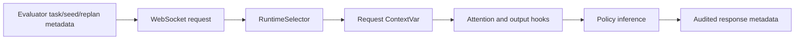

# π0.5 Runtime ATM/OHB 选择器

本文档说明 RoboCasa365 冻结评测使用的最终 runtime selector。该选择器在单个服务进程内按 inference request 切换 ATM/OHB，但最终 v8 规则只使用离线校准统计，不读取 rollout 成功率或运行时反馈。

## 最终冻结版本

- Selector：`runs/atmohb_dynamic_selector_v8/selector.json`
- 规则：`v8_no_oracle_absolute_mechanism_gate_aligned_runtime_rule`
- SHA-256：`0f3178726c2b784898f18dfde248d9a9bae152da6ffcfdc299e8bdc02f0bd871`
- 最终汇总：`runs/atmohb_seeded_atomic_10x10/final_summary_v8.json`
- 保留清单：`runs/atmohb_seeded_atomic_10x10/final/preservation_manifest.json`
- 原始 100-row 矩阵：`runs/atmohb_seeded_atomic_10x10/final/raw/`

v8 的模型级选择结果为：

| 模型 | 候选修正 | 最终模式 | 验证任务上的行为 |
|---|---|---|---|
| GR00T | ATM | `baseline` | 所有请求禁用 ATM/OHB |
| π0.5 | OHB | `ohb` | 所有请求启用 OHB、禁用 ATM |

## Runtime 数据流

request metadata key 是 `__openpi_eval_metadata__`。Evaluator 发送：

- `task_name`
- `task_set`
- `seed`
- `replan_index`
- `config_id`

服务响应和 JSONL 结果记录：

- `runtime_selector_enabled`
- `selected_variant`
- `selected_config_id`
- `selector_sha256`
- `selector_rule_name`
- `selector_task_name`
- `selector_model_id`

## v8 决策规则

v8 先根据量化计划和校准 artifact 确定每个模型的单一候选修正，再要求该修正同时通过三个固定门槛：

| 校准统计 | 门槛 |
|---|---:|
| directional coherence | `>= 0.30` |
| non-neutral fraction | `>= 0.85` |
| mean absolute log correction | `>= 0.05` |

GR00T 的 ATM 未同时通过门槛，因此回退到 GDSQ-VLA baseline。π0.5 的 OHB 同时通过门槛，因此被用于全部任务。任务名称、任务类别、冻结验证结果和 runtime success feedback 都不参与 v8 的模式选择。

## 对齐的量化协议

两个模型共享以下逻辑协议：

- W4A8
- 输入和输出 block size 64
- 静态 per-channel activation scales
- `lambda_smooth = 0.15`
- 4 个 denoising steps
- fake-quant FP16 GEMM backend
- ATM 应用于 runtime query path
- OHB 应用于 runtime output path
- paired action noise：`sha256(task,env_seed,replan_index)/torch-cpu-normal-v1`
- 环境构造和 reset 前应用确定性全局 RNG seed

模型架构不同，因此量化层计划、activation-scale 文件和 ATM/OHB 校准 artifact 分别保存。

## 运行时 artifact

GR00T：

- Plan：`checkpoints/packs/robocasa365/gr00t_quant_plan_robocasa365_cscka_16to1_adjudicated.final_plan.json`
- Pack：`checkpoints/packs/robocasa365/duquant_packed_robocasa365_protocolfix_d4_w4a8_b64c32ls015`
- Activation scales：`checkpoints/packs/robocasa365/a8_scales_cscka_16to1_protocolfix_d4.npz`
- ATM/OHB artifact：`checkpoints/packs/robocasa365/atm_alpha_beta_static_cscka_16to1_protocolfix_d4.json`

π0.5：

- Plan：`runs/pi05_gdsq_gr00t_aligned/plans/pi05_gdsq_cscka_16to1_d4.final_plan.json`
- Pack：`runs/pi05_gdsq_port/packs/pi05_robocasa_block64_w4a8_ls015`
- Activation scales：`runs/pi05_gdsq_gr00t_aligned/a8/pi05_gdsq_cscka_16to1_d4_p999_b32x8.npz`
- ATM/OHB artifact：`runs/pi05_gdsq_gr00t_aligned/atm_ohb/pi05_gdsq_cscka_16to1_d4_static_perhead.json`

## 最终结果

冻结任务为 10 个 atomic tasks，seed 为 0–9；每个配置均有 100 个唯一 `(task, seed)` 结果。

| 模型 | FP16 | GDSQ-VLA | 静态修正 | v8 Runtime Selector |
|---|---:|---:|---:|---:|
| GR00T | 73/100 | 65/100 | ATM 62/100 | 65/100 |
| π0.5 | 61/100 | 57/100 | OHB 63/100 | 65/100 |

## 审计要求

有效的 runtime-selector 结果必须满足：

1. `runtime_selector_enabled == true`。
2. `selected_variant` 和 `selected_config_id` 与冻结 selector 一致。
3. 同一 episode 的所有 replans 使用同一个模式。
4. `selector_sha256` 与服务声明一致。
5. 每个 `(model, task, seed)` 只出现一次。
6. 运行时量化合同与 `cross_model_alignment_v8.json` 一致。